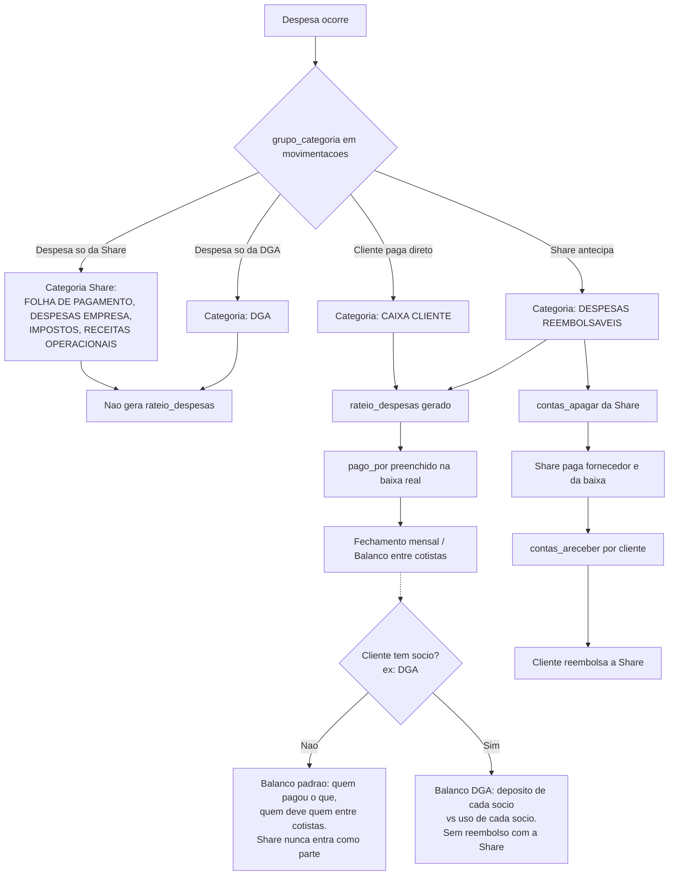

# Share Brasil — Regras de Negócio do Sistema Financeiro

> **Objetivo deste documento:** este é o registro oficial de como o fluxo financeiro do Share
> Brasil funciona. Qualquer alteração de código (nova feature, refactor, correção de bug)
> **precisa respeitar estas regras**. Se uma mudança exigir quebrar algo aqui, este documento
> deve ser atualizado *antes* do código, com justificativa. Isso existe porque historicamente
> mexer em uma parte do sistema quebrava outra parte silenciosamente.

---

## 1. Visão geral

O Share Brasil administra aeronaves compartilhadas entre **cotistas** (clientes que compraram
uma porcentagem da aeronave). Cada cotista usa o avião, gera despesas, e essas despesas
precisam ser rateadas corretamente entre os cotistas — mesmo quando um paga mais do que a
sua parte, mesmo quando a Share antecipa um pagamento, e mesmo em arranjos societários
diferentes (caso DGA).

Existem dois "caixas" conceituais que nunca podem se misturar:

- **Caixa Share**: dinheiro/despesas da própria empresa Share (aluguel, folha, impostos etc.).
- **Caixa Cliente**: dinheiro/despesas do cotista, relacionadas ao uso da aeronave.

Todo lançamento financeiro nasce em `movimentacoes` e, quando pertence a um cliente, se
desdobra obrigatoriamente em `rateio_despesas`. Essas duas tabelas são a fonte da verdade do
sistema — as demais tabelas (`abastecimentos`, relatórios de viagem etc.) são **auxiliares de
conferência**, nunca substituem esse fluxo.

---

## 2. Entidades principais

| Tabela | Papel |
|---|---|
| `clientes` | Um cotista de aeronave. Coluna `tem_socio` indica se esse cliente é, na verdade, um grupo de sócios (ex.: DGA). |
| `cotistas_aeronave` | Vínculo cliente ⇄ aeronave, com `percentual_sociedade` (quanto daquela aeronave o cliente possui). |
| `socios` | Sócios de um cliente com `tem_socio = true` (ex.: os 3 sócios da DGA), cada um com seu próprio `percentual_participacao`. |
| `movimentacoes` | Lançamento financeiro raiz — o "caixa inicial" de qualquer entrada ou saída. |
| `rateio_despesas` | Detalhamento de como uma despesa de cliente foi/deve ser dividida — é a fonte dos fechamentos de balanço. |
| `contas_apagar` / `contas_areceber` | Geradas a partir de `movimentacoes`, controlam pendência de pagamento/recebimento. |
| `categorias_movimentacao` | Categorias das despesas/receitas da **Share**. |
| `expense_configu` | Categorias das despesas do **caixa cliente**. |

---

## 3. O fluxo central (não pode mudar)

### 3.1 `movimentacoes` é sempre o ponto de entrada

Toda despesa — seja da Share, de um cliente, ou reembolsável — é lançada primeiro em
`movimentacoes`, de duas formas:

- **Programação de pagamento**: para contas que ainda precisam ser pagas. O financeiro dá
  baixa depois.
- **Caixa cliente**: para despesas já quitadas diretamente pelo cliente (ele pagou do próprio
  bolso, sem a Share intermediar).

O campo `grupo_categoria` em `movimentacoes` define **de quem** é a despesa e isso determina
todo o resto do fluxo:

| `grupo_categoria` | Significado |
|---|---|
| `FOLHA DE PAGAMENTO`, `DESPESAS EMPRESA`, `DESPESAS EMPRESA-BANCO`, `DESPESAS PARTICULARES`, `IMPOSTOS`, `RECEITAS OPERACIONAIS` | Despesa **só da Share** (ex.: aluguel). Usa `tipo_despesa` = fixo ou variável. Não gera `rateio_despesas`. |
| `DGA` | Despesa **só da DGA** (a holding/sócios), não do rateio geral de clientes. |
| `CAIXA CLIENTE` | Despesa **direta do cliente**, a Share não participa financeiramente — ele pagou e enviou o comprovante. `tipo_caixa` = `cliente`. |
| `DESPESAS REEMBOLSÁVEIS` | Despesa que a **Share antecipa** (paga do próprio caixa) para o cliente reembolsar depois. `tipo_caixa` = `share`. |
| `REEMBOLSOS ENTRADAS` | A entrada no caixa da Share quando o cliente de fato reembolsa o que saiu como `DESPESAS REEMBOLSÁVEIS`. `tipo_caixa` = `share`. |

### 3.1.1 `tipo_caixa`: de quem é o dinheiro *agora*

`tipo_caixa` é uma coluna que existe **só em `movimentacoes`** (valores `share` ou `cliente`).
Ela não indica de quem é a despesa por natureza — indica **de qual caixa o dinheiro está
saindo/entrando neste momento da operação**. É por isso que uma despesa "do cliente" pode ter
`tipo_caixa = share`:

- Se o cliente paga direto do próprio bolso → `grupo_categoria = CAIXA CLIENTE`,
  `tipo_caixa = cliente`. O dinheiro nunca passou pelo caixa da Share.
- Se a Share antecipa (paga primeiro, do caixa dela, pra depois cobrar do cliente) →
  `grupo_categoria = DESPESAS REEMBOLSÁVEIS`, mas **`tipo_caixa = share`** — porque é o caixa
  da Share que está desembolsando agora, mesmo sendo uma despesa que pertence ao cliente. A
  categoria específica (`categoria_id` / `categorias_movimentacao`) usada aqui é a mesma que o
  usuário selecionaria normalmente para aquele tipo de gasto — o que muda é o `grupo_categoria`
  (marca como reembolsável) e o `tipo_caixa` (marca que quem desembolsou foi a Share).
- Quando o cliente reembolsa esse valor, gera-se uma **nova movimentação** de entrada com
  `grupo_categoria = REEMBOLSOS ENTRADAS` e `tipo_caixa = share` (entrada no caixa da Share).
- Enquanto isso não acontece, a despesa fica pendente para o cliente — em `movimentacoes` isso
  aparece como uma situação de "aguardando reembolso" (ex.: `status = aguardando_reembolso`),
  representando que ele ainda deve pagar a Share por aquele valor.

Ou seja: **`movimentacoes` (via `tipo_caixa` + `status`) é onde fica registrada a situação
Share ⇄ cliente daquela despesa** — quem desembolsou primeiro e se já foi reembolsado ou não.

### 3.1.2 Regra de geração do rateio

Toda despesa lançada para um cliente (`CAIXA CLIENTE` ou `DESPESAS REEMBOLSÁVEIS`),
independente de ter sido direta ou reembolsável, **precisa gerar um registro em
`rateio_despesas`**. Sem exceção. É esse registro que carrega a verdade sobre o rateio.

**Importante:** `rateio_despesas` é **agnóstico** a quem desembolsou o dinheiro
(Share ou o próprio cliente). Ele mostra a divisão correta da despesa **entre os cotistas**,
como se cada um tivesse pagado certinho do próprio bolso — a situação de "quem adiantou pra
quem" (Share ⇄ cliente) fica só em `movimentacoes`. Isso vale mesmo quando a Share pagou o
fornecedor: no rateio o que importa é a divisão entre os clientes, não se a Share intermediou
o pagamento.

### 3.3 `rateio_despesas` é a fonte da verdade do rateio

`rateio_despesas` registra, para cada despesa de cliente:

- Quem pagou de fato (`pago_por`).
- Se cada cotista pagou a sua parte corretamente, ou se algum pagou sozinho (gerando um
  crédito a ser resolvido depois entre os cotistas).
- O percentual correto de cada cotista naquela despesa (`percentual_sociedade` /
  `percentual_uso`).
- Se é uma despesa que envolve só um cliente (ex.: abastecimento de um cotista específico) ou
  se é rateada entre todos.
- O tipo de rateio (`tipo_rateio`: fixo, mensal, extra, variável, variável por voo, variável
  por hora).

`rateio_despesas` é usado para fechar **todos** os balanços — tanto de clientes simples quanto
de clientes com sócios (DGA).

### 3.4 `pago_por`: o lançamento teórico vs. a realidade da baixa

O lançamento inicial em `movimentacoes`/`rateio_despesas` é feito **da forma que deveria
ocorrer teoricamente** (ex.: "essa despesa deve ser dividida 50/50"). Só no momento da **baixa
do pagamento** é que sabemos como de fato ocorreu. Por isso `pago_por` em `rateio_despesas` é
preenchido nesse momento, com quem realmente pagou — podendo divergir do que estava previsto.

Exemplo: uma despesa devia ser rateada entre o cliente X e o cliente Y, mas X pagou o valor
total sozinho. Nesse caso:
- `rateio_despesas` do X → `pago_por` = X (ele pagou o total).
- `rateio_despesas` do Y → `pago_por` também registra quem pagou (X), para deixar explícito
  que Y não pagou nada dessa despesa e está devendo a sua parte a X.

### 3.5 Geração automática de contas a pagar / a receber

Toda programação de pagamento gera um `contas_apagar`, e o tipo de conta muda o comportamento:

- **Conta só da Share**: é uma conta a pagar da própria Share.
- **Conta do cliente**: é uma conta que o cliente precisa pagar; o financeiro apenas monitora
  a pendência (não é dívida da Share).
- **Conta de reembolso** (`DESPESAS REEMBOLSÁVEIS`): é uma conta a pagar da **Share** — a Share
  paga o fornecedor primeiro. Depois de paga, gera um ou mais `contas_areceber`, um por
  cliente, com o valor exato que cada um deve.

**Exemplo prático (tarifa DECEA, aeronave com 2 cotistas):**
1. Gera-se uma programação de pagamento → `contas_apagar` para a Share.
2. A Share paga o fornecedor da DECEA e dá baixa (fornecedor quitado).
3. Gera-se `contas_areceber` para cada cliente com o valor exato de cada um (ex.: cliente X
   paga valor X, cliente Y paga valor Y).
4. Em `rateio_despesas` são criados 2 lançamentos (um por cliente), com `pago_por` = o nome de
   cada cliente — porque, mesmo a Share tendo pago o fornecedor originalmente (isso fica
   registrado em `movimentacoes`), no rateio o que importa é quem efetivamente pagou a Share
   depois, separado corretamente por percentual.

---

## 4. Fechamento mensal / Balanço

### 4.1 Clientes simples (sem sócios)

O balanço mensal apresenta o extrato de custos da aeronave e mostra **quem pagou o quê e quem
deve quem entre os cotistas**.

**Regra crítica:** a Share **nunca** entra como parte do balanço entre cotistas, mesmo quando
ela antecipou algum pagamento. Isso porque, quando a Share antecipa, o cliente paga a Share de
volta (fluxo de reembolso) — então esse dinheiro já circula fora do balanço entre cotistas. O
fechamento de balanço é estritamente **entre os cotistas da aeronave**.

### 4.2 Clientes com sócios (caso DGA)

Não confundir com "holding" — o termo correto é **cliente com sócios** (`clientes.tem_socio =
true`, detalhado em `socios`). Hoje o único caso real é a DGA, mas a regra precisa se sustentar
para outros clientes com sócios no futuro.

Como funciona:
- Os sócios (ex.: 3 sócios na DGA, equivalente a 3 cotistas) criam um CNPJ único, e a
  aeronave fica em nome desse CNPJ.
- Cada sócio deposita mensalmente, por conta própria, um valor numa conta bancária desse CNPJ.
- O financeiro paga **todas** as contas relacionadas àquele cliente (abastecimento, despesas
  de viagem etc.) a partir dessa única conta.

O fechamento de balanço nesse caso é **diferente** do balanço de clientes simples:
- Mostra quanto **cada sócio depositou**.
- Mostra quanto **cada sócio está usando** (gastando).
- Indica se o uso está condizente com o depósito, ou se o sócio está devendo.
- Considera a hipótese de um sócio pagar uma despesa **do próprio bolso**, fora da conta do
  CNPJ — o que gera um tipo de dívida diferente (dívida entre sócios, não entre sócio e conta
  comum).

**Regra crítica:** nesse arranjo **não existe reembolso com a Share** — toda despesa sempre
sai diretamente da conta bancária do CNPJ (nunca via fluxo `DESPESAS REEMBOLSÁVEIS` da Share).

---

## 5. Custo mensal de administração (ADM)

Todos os clientes — com ou sem sócios — pagam mensalmente à Share um custo de administração.
Dependendo do cliente, gera-se "ADM e pilotagem" ou apenas "ADM". Esse lançamento:
- Sai do **caixa cliente** (despesa do cliente).
- Entra no **caixa Share** como receita.

---

## 6. Empréstimo de aeronave

Quando a aeronave é emprestada a um cliente que **não é cotista dela** (`emprestimos_aeronave`,
`lancamentos_diario_bordo.emprestimo`, `socio_tomador_emprestimo_id` /
`cliente_tomador_emprestimo_id`):

- Despesas variáveis do voo (abastecimento, tarifas de pouso, INFRAERO, DECEA etc.) são pagas
  por **quem usou** o avião (o tomador do empréstimo).
- **Mas no rateio**, esse voo é considerado como se o **cotista proprietário que emprestou**
  tivesse voado — porque, na hora de ratear despesas de manutenção/uso percentual da
  aeronave, é o proprietário quem assume aquele uso.

Ou seja: quem paga a despesa pontual do voo (combustível, taxas) ≠ quem "usa" o percentual de
horas para fins de rateio de manutenção. Essas duas coisas são propositalmente separadas.

---

## 7. Tabelas auxiliares (nunca substituem o fluxo central)

Algumas tabelas existem só para facilitar a conferência de um tipo específico de despesa, mas
**a regra de sempre gerar `movimentacoes` + `rateio_despesas` não muda**:

- `abastecimentos`: gravado quando se lança um abastecimento (além do lançamento financeiro
  normal).
- Relatórios de despesa de viagem (`travel_expense_reports` / referenciado por
  `reference_type`/`reference_id` em `movimentacoes`): gravado quando se cria um relatório de
  voo.
- Outras tabelas de despesa específica seguem o mesmo princípio: são **espelhos de
  conferência**, não fontes alternativas de verdade.

---

## 8. Categorias

- **Despesas/receitas da Share** → categorizadas via `categorias_movimentacao`.
- **Despesas do caixa cliente** → categorizadas via `expense_configu`.

Essas duas tabelas de categoria **não devem ser misturadas** — uma despesa de cliente nunca
deve ser classificada usando `categorias_movimentacao`, e vice-versa.

---

## 9. Diagrama do fluxo

---

## 10. Invariantes — nunca podem ser quebrados por uma alteração de código

1. Toda despesa de cliente (direta ou reembolsável) **sempre** gera um registro em
   `rateio_despesas`. Sem exceção.
2. O fechamento de balanço entre cotistas **nunca** inclui a Share como parte devedora ou
   credora — ela é sempre intermediária, mesmo quando antecipa pagamentos.
3. `pago_por` reflete a realidade da baixa (quem pagou de verdade), não o plano teórico do
   lançamento original.
4. `tipo_caixa` (só existe em `movimentacoes`) indica de qual caixa o dinheiro saiu/entrou
   **agora** (Share ou cliente) — não indica de quem é a despesa por natureza. Uma despesa
   `DESPESAS REEMBOLSÁVEIS` é do cliente, mas tem `tipo_caixa = share` porque foi a Share quem
   desembolsou primeiro.
5. `rateio_despesas` é **agnóstico** a quem desembolsou o dinheiro — ele sempre mostra a
   divisão correta entre os cotistas, como se cada um tivesse pago do próprio bolso. A situação
   de adiantamento Share ⇄ cliente vive só em `movimentacoes`, nunca em `rateio_despesas`.
6. Empréstimo de aeronave: quem usou paga as despesas variáveis do voo, mas o **rateio de uso
   percentual** é sempre atribuído ao cotista proprietário que emprestou a aeronave.
7. Clientes com sócios (ex.: DGA) **não usam** o fluxo de reembolso com a Share — todo
   pagamento sai direto da conta bancária do CNPJ dos sócios.
8. `categorias_movimentacao` categoriza despesas da Share; `expense_configu` categoriza
   despesas de caixa cliente. Nunca misturar.
9. As tabelas auxiliares (`abastecimentos`, relatórios de viagem etc.) são espelhos de
   conferência — a regra de sempre passar por `movimentacoes` + `rateio_despesas` não muda
   por causa delas.

---

*Última atualização: gerado a partir da explicação de regras de negócio fornecida pela
fundadora do Share Brasil. Ao alterar qualquer parte do fluxo financeiro descrito aqui,
atualize este documento no mesmo PR.*
